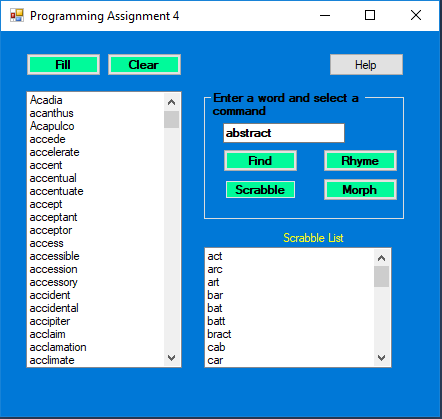
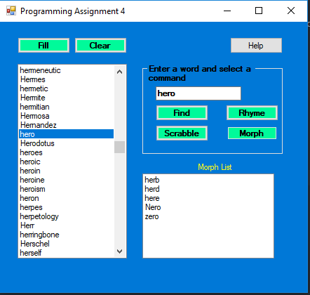

# WordSearchTools

A GUI application that provides tools for retrieving specific types of words from a text file with approximately 22,000 words. The program is able to list all words, rhyming words, scrabble words, and morph words.

## Getting Started

These instructions will get you a copy of the project up and running on your local machine for development and testing purposes.

### Prerequisites

```
Visual Studios
```

## Running the tests

Sample Picture of finding a specific word


Sample Picture of rhyming words


Sample Picture of scrabble words



Sample Picture of morph words



## Author

**Steven Duong**
